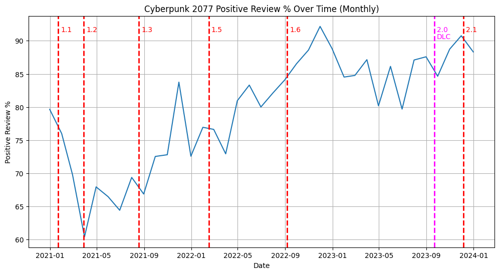
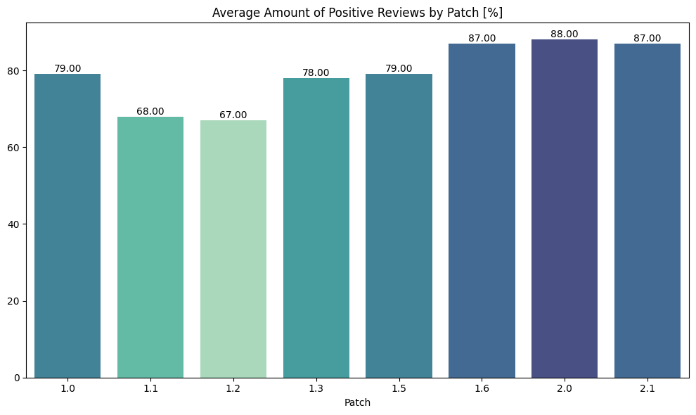
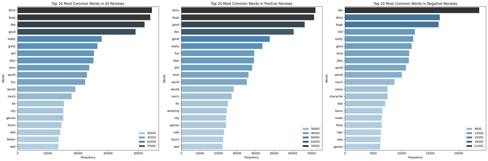
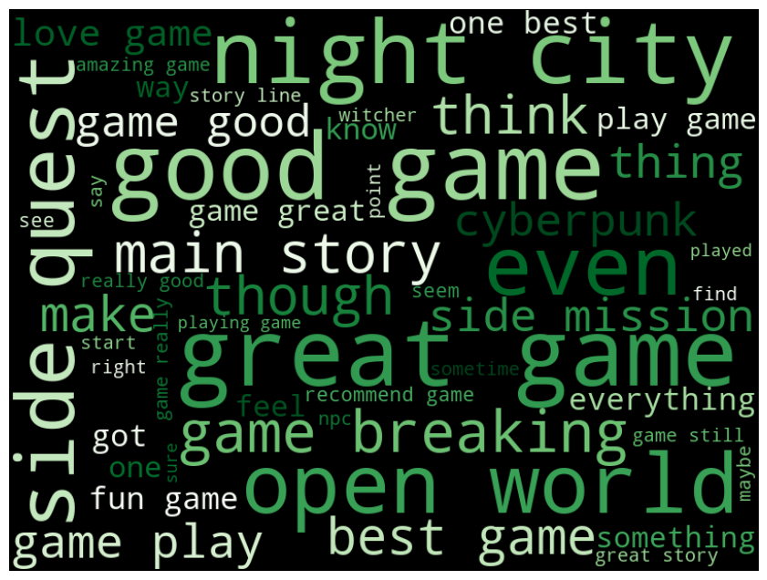
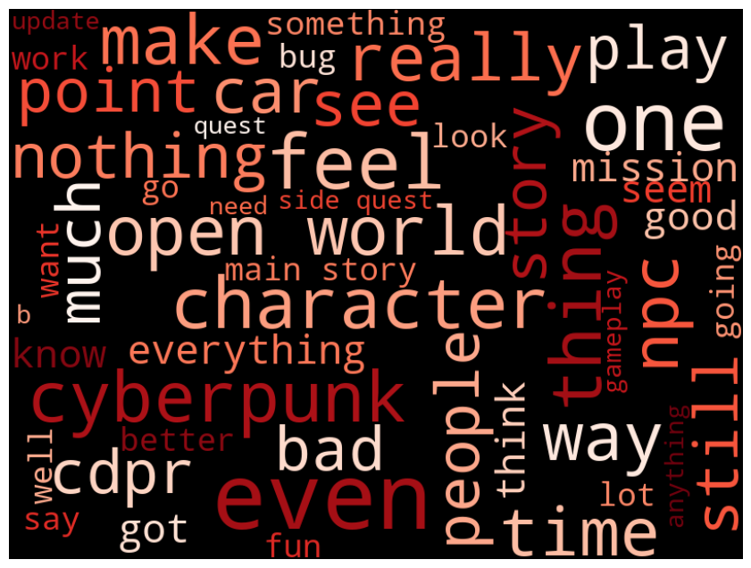
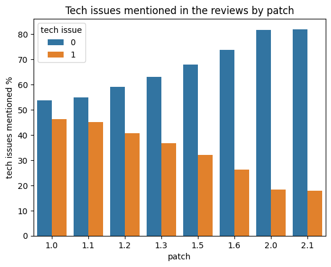

## Cyberpunk 2077 Steam Reviews NLP Analysis
Cyberpunk 2077 developed by CD Projekt Red, is an open-world RPG set in the futuristic metropolis of Night City. My main goal for this analysis is to assess how the perception of Cyberpunk 2077 has evolved over time and to uncover as many insights from the data as possible.

## Goals 
This project aims to delve deep into the player feedback for Cyberpunk 2077 by analyzing Steam reviews using Natural Language Processing (NLP) techniques. This analysis not only provides a quantitative measure of the game's reception over time but also offers qualitative insights that can be pivotal for understanding the evolution of player sentiment and the game's development post-release.

## Deeper Understanding of Player Sentiments
Evolving Perceptions: By tracking reviews across different patches, the project highlights how players' opinions have changed in response to updates and fixes. This can reveal whether the game has matured in a direction that aligns with player expectations.
Emphasis on Specific Aspects: Identifying the most frequently mentioned themes in reviews (like open-world experience, storyline, character development, etc.) offers insights into what players value the most in Cyberpunk 2077.

## Impact of Technical Issues and Updates
Technical Challenges: The project sheds light on the nature and frequency of technical issues mentioned in reviews. This can help understand the impact of these issues on overall game experience and reputation.
Response to Patches: By correlating reviews with specific patches, the analysis can demonstrate how effectively each update addressed the players' concerns and improved the game experience.

## Most Important Visualizations

  
Positive review % by month

   

  
Positive review % by patch

     

  
Most common words

     

  
Positive reviews wordcloud

     

  
Negative reviews wordcloud

     

  
Tech issues mention by patch

     

